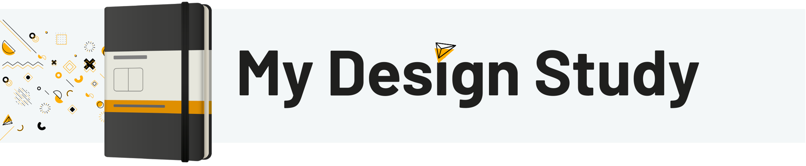

# Welcome

## Visit [My Portfolio](http://www.matthewsheadesign.com)

Welcome to my study of design. I’m **Matthew Shea**, a UI/UX Designer and creative leader. I’ve spent **15 years** as a designer at studios, universities, newspapers, and agencies. I have gained so much knowledge, and found that I have so much more to learn.

This site is my **personal wiki** to continue my journey of never ending self learning and to capture my knowledge along the way.

Everything is in progress and will hopefully always be. The design projects I work on throughout my career bring new exciting experiences. They require exploration and reserach building on the knowledge I hope to capture here.

## Let's connect

Let's connect on [Twitter](https://twitter.com/Matthew_J_Shea), [Dribbble](https://dribbble.com/Mshea), [Instagram](https://www.instagram.com/matthew.shea.design/), and [LinkedIn](https://www.linkedin.com/in/matthew-james-shea/)

